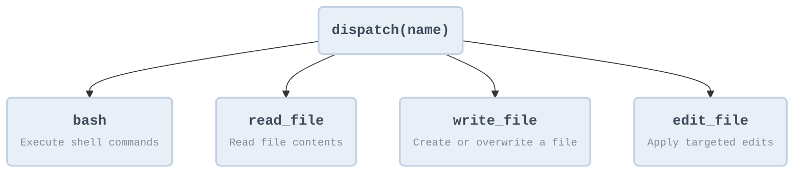

# Weekly Programming 26-13

## Agent While 循环

一个工具 + 一个循环 = 一个智能体

```mermaid
graph TD
    %% 定义全局样式
    classDef default fill:#e9eff7,stroke:#c1d1e3,stroke-width:2px,color:#3d4b5b,font-family:monospace,font-weight:bold;
    classDef decision fill:#ffffff,stroke:#c1d1e3,stroke-width:2px,color:#3d4b5b,font-family:monospace,font-weight:bold;

    %% 节点定义
    Start([Start])
    API_Call[API Call]
    Stop_Reason{stop_reason?}
    Break_Done([Break / Done])
    Execute_Tool[Execute Tool]
    Append_Result[Append Result]

    %% 流程连接
    Start --> API_Call
    API_Call --> Stop_Reason
    
    Stop_Reason -- "end_turn" --> Break_Done
    Stop_Reason -- "tool_use" --> Execute_Tool
    
    Execute_Tool --> Append_Result
    Append_Result -- "" --> API_Call

    %% 应用特定样式
    class Stop_Reason decision;
```

```text
+--------+      +-------+      +---------+
|  User  | ---> |  LLM  | ---> |  Tool   |
| prompt |      |       |      | execute |
+--------+      +---+---+      +----+----+
                    ^                |
                    |   tool_result  |
                    +----------------+
                    (loop until stop_reason != "tool_use")
```

## 工具

加一个工具, 只加一个 handler -- 循环不用懂, 新工具注册进 dispatch map 就行



```text
+--------+      +-------+      +------------------+
|  User  | ---> |  LLM  | ---> | Tool Dispatch    |
| prompt |      |       |      | {                |
+--------+      +---+---+      |   bash: run_bash |
                    ^           |   read: run_read |
                    |           |   write: run_wr  |
                    +-----------+   edit: run_edit |
                    tool_result | }                |
                                +------------------+

The dispatch map is a dict: {tool_name: handler_function}.
One lookup replaces any if/elif chain.
```
