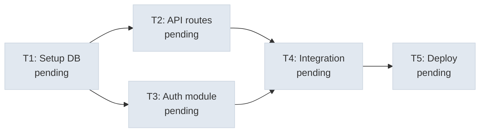

# Weekly Programming 26-14

## Agent TodoWrite

没有计划的 agent 走哪算哪, 先列步骤再动手, 完成率翻倍

```text
+--------+      +-------+      +---------+
|  User  | ---> |  LLM  | ---> | Tools   |
| prompt |      |       |      | + todo  |
+--------+      +---+---+      +----+----+
                    ^                |
                    |   tool_result  |
                    +----------------+
                          |
              +-----------+-----------+
              | TodoManager state     |
              | [ ] task A            |
              | [>] task B  <- doing  |
              | [x] task C            |
              +-----------------------+
                          |
              if rounds_since_todo >= 3:
                inject <reminder> into tool_result
```

## 子 agent

子 agent 上下文隔离

大任务拆小, 每个小任务有干净的上下文, 子 agent 用独立的 messages[], 不污染主对话

```text
Parent agent                     Subagent
+------------------+             +------------------+
| messages=[...]   |             | messages=[]      | <-- fresh
|                  |  dispatch   |                  |
| tool: task       | ----------> | while tool_use:  |
|   prompt="..."   |             |   call tools     |
|                  |  summary    |   append results |
|   result = "..." | <---------- | return last text |
+------------------+             +------------------+

Parent context stays clean. Subagent context is discarded.
```

## skills

skills 按需加载

用到什么 skill, 就临时加载 skill, 通过 tool_result 注入, 不塞进 system prompt 中

```text

System prompt (Layer 1 -- always present):
+--------------------------------------+
| You are a coding agent.              |
| Skills available:                    |
|   - git: Git workflow helpers        |  ~100 tokens/skill
|   - test: Testing best practices     |
+--------------------------------------+

When model calls load_skill("git"):
+--------------------------------------+
| tool_result (Layer 2 -- on demand):  |
| <skill name="git">                   |
|   Full git workflow instructions...  |  ~2000 tokens
|   Step 1: ...                        |
| </skill>                             |
```

## 任务系统



大目标要拆成小任务, 排好序, 记在磁盘上, 文件持久化任务图, 为多 agent 协作打基础

```text
.tasks/
  task_1.json  {"id":1, "status":"completed"}
  task_2.json  {"id":2, "blockedBy":[1], "status":"pending"}
  task_3.json  {"id":3, "blockedBy":[1], "status":"pending"}
  task_4.json  {"id":4, "blockedBy":[2,3], "status":"pending"}

任务图 (DAG):
                 +----------+
            +--> | task 2   | --+
            |    | pending  |   |
+----------+     +----------+    +--> +----------+
| task 1   |                          | task 4   |
| completed| --> +----------+    +--> | blocked  |
+----------+     | task 3   | --+     +----------+
                 | pending  |
                 +----------+

顺序:   task 1 必须先完成, 才能开始 2 和 3
并行:   task 2 和 3 可以同时执行
依赖:   task 4 要等 2 和 3 都完成
状态:   pending -> in_progress -> completed
```
